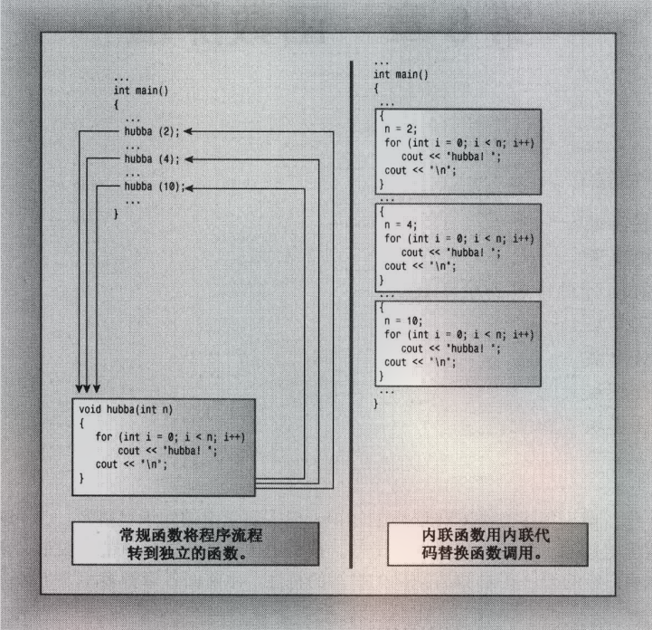

<!-- vim-markdown-toc GFM -->

* [迟早学习笔记](#迟早学习笔记)
	* [缩窄转换](#缩窄转换)
	* [指针](#指针)
	* [函数指针](#函数指针)
	* [变量的引用](#变量的引用)
	* [引用](#引用)
	* [默认参数](#默认参数)
	* [函数重载](#函数重载)
		* [函数的参数相同类型时](#函数的参数相同类型时)

<!-- vim-markdown-toc -->
# 迟早学习笔记  
<font size=3>`This is my c notes`</font>   
## 缩窄转换  
* 缩窄转换  
	* 当我们使用`int` 类型转换成 `short`   
	`int` 是 4 个字节 `short` 是两个字节 当我们将`int`的类型变量转换成 `short` 那么这个操作就是缩窄转换
	```c++
		std::cout << sizeof(int) << sizeok(short) << std::endl;
	```
	* 在初始化列表时，是禁止缩窄转换的 例如:
	```c++
	long list[3] {1,2,3.5}; // 这样是进制的
	```
* c++ 其他字符串类型    
<u>编写程序时通常会面对一些不同的编码格式，如Unicode和multibytes。在有关字符串的处理时尤其重要，系统编程时通常会遇到很多这样的问题，例如把wchar*的字符串转换为char*的字符串，有时还需要把char*类型的字符串转换为wchar*类型。下面提供几种解决方案。</u>
	* wchar  
	```c++
	wchar_t *wc = L"hello world!"; 

	```
* c++ 结构体  
	* 结构体`struct` 一个不同类型的数据集合
	```c++ 
	// 定义一个 students 结构体
	struct Students
	{
		char name[20];
		unsigned int age;
		unsigned float results;
	}
	```
	结构体的内存是一种对齐的格式的 <br>
	char 类型的占一个字节，unsigned int 占4 字节 那么char在分配内存的时候也是分配的四个字节 <u>结构体中的内存会对齐最大的内存</u>
## 指针 
* 指针 
	* 指针与普通变量是一种截然不同的存储结构  
	普通变量是将值当做常量，编译器在编译的时候自动为其分配内存  
	指针将内存地址当作常量，将存储的值作为派生量，使用*访问的是指针指向的地址上面的值  
	```c++
	int p = 2;
	int *d;
	d = &p;
	std::cout << d << *d << std::endl;  // 输出指针的值和指针的值所存储的值
	```
* c++ 数组的替代品
	* 模板类`vector`<br>
	```c++
	//使用方法
	vector<int> vi(2); 		// 定义一个int 类对象
	vi[0] = 2;
	vi.insert(vi.end(),1);  // 在末尾末尾插入一个 1
	cout << vi[0] << endl;
	```
	* 模板类 `array`<br>
	`vector` 功能强大但是，效率比较低，`array` 拥有和数组相等的效率,和数组一样是固定边界,但是比数组更加安全  
	```c++
	array<int,2> a; // 定义一个int array数组边界为2
	a[0] = 1;
	a[1] = 2;
	cout << a << endl;
	```
* 逗号表达式
	* 使用逗号运算符是为了把几个表达式放在一起，整个逗号表达式的值为系列中的最后一个值
	```c++
	// 	表达式1，表达式2,表达式返回值
	var = (count=19,incr=10,count+1);
	// 在这里，首先把 count 赋值为 19，把 incr 赋值为 10，然后把 count 加 1，最后，把最右边表达式 count+1
	//的计算结果 20 赋给 var。上面表达式中的括号是必需的，因为逗号运算符的优先级低于赋值操作符。
	```
* #### cctype
	* #### `isalpha()` <font size=2>判断是否为字母</font>
	* #### `ispunct()` <font size=2>判断是否为数字</font>
* 三目运算符
	* ?:
	```c++
	std::cout << (2 > 3 ? 10 : 19) << std::endl;
		//   2 比3 小,所以为true 返回19
	```
## 函数指针
*  声明一个函数指针
	```c++
	double *(*pr)(int); // pr 为函数的地址
	const double *f1(const double ar[] ,int n);
	// 下面为实例
	#include<iostream>
	using namespace std;
	const double *f1(const double ar[] ,int n);
	const double *f2(const double [] ,int n);
	const double *f3(const double * ,int n);

	int main(int argc,char *argv[])
	{
		const double *(*p1)(const double *,int) = f1;
		const double av[3] {1,2,3};
		cout << (*p1)(av,3) << " : " << *(*p1)(av,3) << endl;
		auto pd = f2;
		cout << pd(av,3) << " : " << *pd(av,3) <<  endl;
		return 0;
	}

	const double *f1(const double ar[] ,int n)
	{
		return ar;
	}
	const double *f2(const double ar[] ,int n)
	{
		return ar+1;
	}
	const double *f3(const double *ar ,int n)
	{
		return ar+2;
	}


	```

* 内敛函数
	* 运行过程
	* 
	* 内敛函数编译时会把函数替换成函数的副本代码，当调用多次的时候，会生成多个副本造成内存负担，适当选择使用,即使它速度很快
	* `inline` 标识内敛函数
	```c
	inline double prins(double num)
	{
		std::cout << "hello wrold" << num << std::endl;
	   return 0;
	}
	// 像这段代码，如果在main函数中调用则编译完成之后实际上是这样的
	main
	{
		// prins(3);
		{
			std::cout << "hello world" << 3 << std::endl;
		}
		return 0;
	}
	```
## 变量的引用
* c++ 新增了一种复合类型--引用变量。引用就是为已经定义的变量的别名
	* 创建引用变量
	```c
	int main(int argc,char *argv[])
	{
		int res = 10;
		int & rodents =  res; // rodents 就是tes,只是换了一个名称 
		cout << rodents << endl;
		return 0;
	}
	```
	* 引用必须是在创建时候就初始化,有点类似于 `const`
	* 引用作为函数的参数<br>
	`下面的实例修改变量的参数`
	```c
	void max(int & a);
	void swap(int *a);

	int main(int argc,char *argv[])
	{
		int a = 1;
		int s = 1;
		max(a);
		swap(&s);
		cout << a << endl;
		// cout a = 3
		cout << s << endl;
		// cout s = 3
		return 0;
	}
	void max(int &  a)
	{
		a += 2;
	}
	void swap(int *a)
	{
		*a += 2;
	}
	```
## 引用	  
* 程序员使用对象的参数的主要原因有两个
	* 程序源可以修改调用函数中的对象参数
	* 通过传递引用而不是整个数据对象，可以提高计算机的运行速度  
	* 什么时候使用引用
		* 对于传递值而不做修改的函数
			* 如果数据对象很小，如内置的数据结构，则按值传递
			* 如果是数组，则使用指针，这是唯一的选择，并将指针生命为`const` 的指针。
			* 如果对象是较大的数据结构，则使用`const`指针或`const`引用，以提高程序的执行效率 。
			* 如果数据对象是类对象，则使用`const`引用，类设计的语义，常常要求使用引用，这是`c**`新增的特性主要原因,因此传递类对象使用引用
		* 对于修改函数中的数据
			* 如果函数对象是内置的数据类型,则使用指针。
			* 如果对象是数组则使用指针。
			* 如果对象是结构，则使用指针或引用。
			* 如果对象是类对象，则使用引用。

## 默认参数
<font size=5>**`对于带参数的函数,必须从右想左添加默认值。依旧是说，要为某个参数设置默认值，就必须为他右边的所有参数设置默认值`**  </font>

```c
int haro(int n,int s = 1,int j = 5);
使用的时候我们可以提供一个两个或者三个参数
haro(1);
haro(1,2);
haro(1,2,3);
```
<font size=4>**`实参按从做到右的顺序依次赋值给相应的形参,因此不能跳过任何一个参数`**  </font>
*下面的代码错误的*

```c
haro(1,,0); //   这是不允许的
```
## 函数重载
<font size=3>*函数的多态，允许你使用多个同名函数实现不同的功能*</font>  
<font size=2>c艹允许定义相同的函数，条件是他们的参数条目不同</font>  
```c
void print(int a,char b);    // use #1
void print(char a,char b);   // use #2
void print(double a,char b); // use #3
// 使用print函数时，c艹编辑器，将根据采取的相应的用法使用有相应特征标的原型:
print(1,'s');                // use #1
print('2','s');              // use #2
print(1.0,'s');              // use #3
```
### 函数的参数相同类型时
```c
#include<iostream>
using namespace std;
void a(int a);
void a(int * a);
int main(int argc,char *argv[])
{
	int *a = new int;
	*a = 1;
	int b = 2;
	a(a);  // 在这里无论是使用指针还是变量都是一个错误,他不与任何一个原型匹配 
	a(b);
	return 0;
}
void a(int a) { 
	cout << "int" << endl; }
void a(int * a) { 
	cout << "int *" << endl; }
```
<font size=3>编译器在检查函数的特征标时，把类型引用和类型本身视为同一个特征标,匹配函数时并不区分`const`和非`const`的变量</font>

